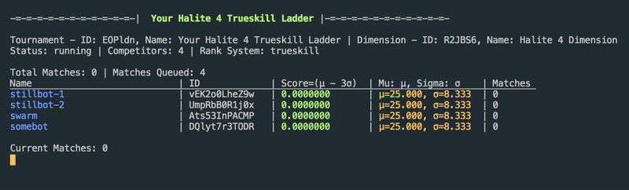

# Halite 4 Tournament Runner

This code allows you to run a local tournament ranking bots you provide by the Trueskill or ELO ranking algorithm (somewhat similar to the current Kaggle leaderboard ranking system)

Ensure you have [NodeJS](https://nodejs.org/) version 12.x or above installed

To run the tournament, fork this repo or clone it to your computer, and first install the [Dimensions](https://github.com/stonet2000/dimensions) package
```
npm install dimensions-ai
```
then run
```
node run.js
```



to see a live display of a leaderboard of 4 bots. The sample bots used here for demonstration are the swarm bot by Yegor Biryukov: https://www.kaggle.com/yegorbiryukov/halite-swarm-intelligence, the getting started bot provided by Kaggle: https://www.kaggle.com/alexisbcook/getting-started-with-halite, and a bot that does nothing called stillbot.

To add more bots, add them to the list in `run.js` at line 48. Note that you have to pass in paths to a file (so you can't use the Kaggle given random bot, you will have to copy it over yourself)

## Configuration

To use ELO ranking instead of trueskill (the default), change line 60 in `run.js` to `Tournament.RANK_SYSTEM.ELO`

This will also automatically generate log files that record all output to standard error only. To turn this off, change line 65 in `run.js` to `false`.

You can also configure how the tournament runs by editing the configs in line 71 in `tournamentConfigs`

`maxConcurrentMatches` is the number of matches the tournament will simutaneously run. Try not to set this way above the number of cores you have or you may run into timeout issues.

`maxTotalMatches` is the total number of matches the tournament will allow itself to run before shutting down.

`endDate` is the date in which to end the tournament. You can give the tournament a set lifespan. This takes in a javascript `Date` object, see the comment for an example

By default, some of these options are commented out, just uncomment them and change them as you like!

## Retrieving data live from Tournament

By default, the API to retrieve such data is turned off. To turn it on, change `observe` and `activateStation` to `true` at lines 38 and 39. This will serve an API at `localhost:9000`. See https://github.com/StoneT2000/Dimensions/wiki/Dimensions-Station-API for a description of how to use the API. Through the API, you can retrieve rankings, start and stop a tournament and more.

At the moment, `run.js` sets the IDs as follows
`dimensionID: h4`, `tournamentID: h4ladder`

So a request in the shape of `/api/dimensions/:dimensionID/tournament/:tournamentID/ranks` becomes `/api/dimensions/h4/tournament/h4ladder/ranks`

### Notes

The file `run.sh` has the script that is used to run the matches in the tournament

Unfortunately, Windows doesn't work, you will need WSL
